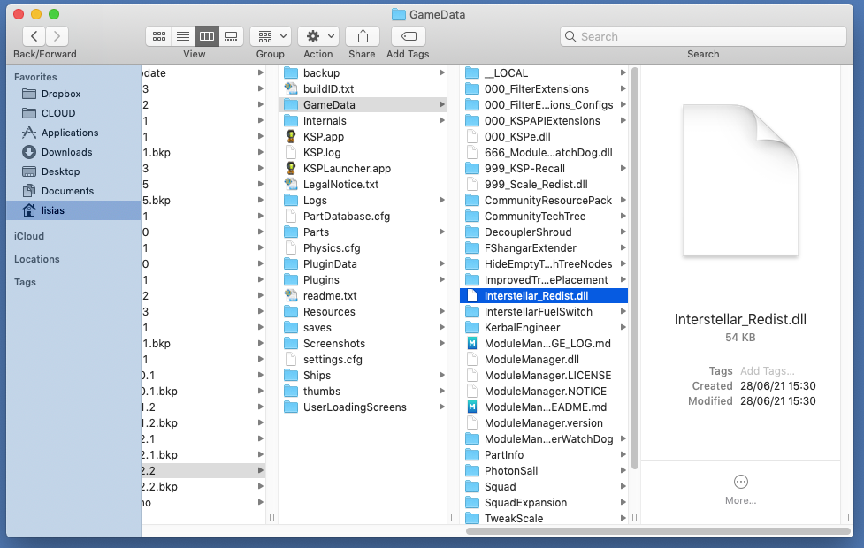
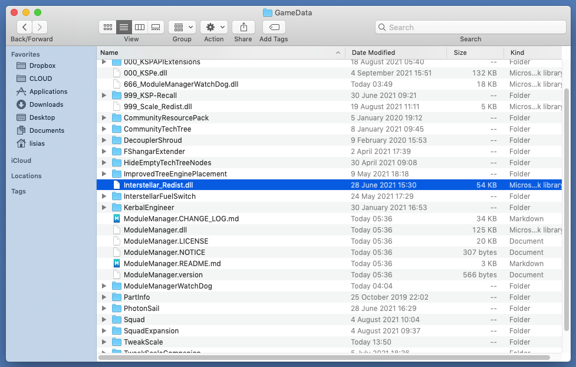
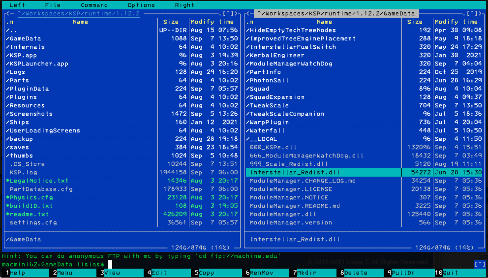

# Watch Dog for Interstellar Redist dll :: Known Issues

This is a troubleshooting list to help you on fixing your installment.

If you need further help, please visit [Forum's KSP Interstellar Extended Support Thread](https://forum.kerbalspaceprogram.com/index.php?/topic/172026-*/).

## Known detectable problems

### There're more than one `Interstellar Redist Watch Dog` on this KSP installment!

Well, somehow you managed to have installed more than one copy of this tool itself!

Check `GameData/` for DLLs with the name `WatchDogForInterstellarRedist` on it and delete all of them - but the one inside `GameData/ModuleManagerWatchDog/`.

### "There's no Interstellar Redist dll on this KSP installment, besides you having installed known DLL(s) that need it"

When installing Add'Ons [CurseForge Installer](https://download.curseforge.com) the `Interstellar_Redist.dll` is not automatically installed on your `GameData` by limitations of the tool. Also, when installing it manually, it's pretty common to forget to install this file.

In a way or another, you need to download manually the zip package and manually copy it into your `GameData`, that must so be similar to this:

Or, if you are a terminal freak :P :

### "There're more than one Interstellar Redist dll on this KSP installment!"

Unfortunately, from KSP 1.8.0 and above a potential fatal bug is affecting every DLL when more than one copy if it is installed on your system, causing many troubles from using older, buggy versions of such DLL to hanging KSP itself.

In the past, it was usual that every Add'On that depends on it had it embedded (what's less than ideal anyway, as this impacts performance on KSP due how C# runtime works), and so if you have these oldies installed you will be bitten for sure.

Another possibility is just a mishap while installing add'ons - it happens, I wrote the WatchDog tool exactly to help me to prevent doing that myself! ;) 

To fix this there's no other solution available but to manually **DELETE** all redundant copies of the DLL, leaving only the one on the `GameData/`. 

See the "How I fix this?" Section below to, well, see how to fix it! :)

### "Interstellar Redist dll *must be* directly on GameData (and not inside any subfolder) and *should* be named `Interstellar_Redist.dll`"

Another measure to prevent problems at runtime on KSP (due the reasons explained on the sections above) is to make sure that the `Interstellar_Redist.dll` is not only placed **exactly** on your GameData, but it's also named exactly as specified. This ended up being important on KSP 1.12.x that changed significatively how DLL are loaded on startup, what made harder to detect misplaced DLLs.

If by some reason you (or something else) accidentally renamed or moved this file, you will get this error.

"There can be only one"!! :) And it's picky about how you call it. :D

See the "How I fix this?" Section below to, well, see how to fix it! :)

## How I fix this???

***\*\*\*Work in Progress \*\*\****

